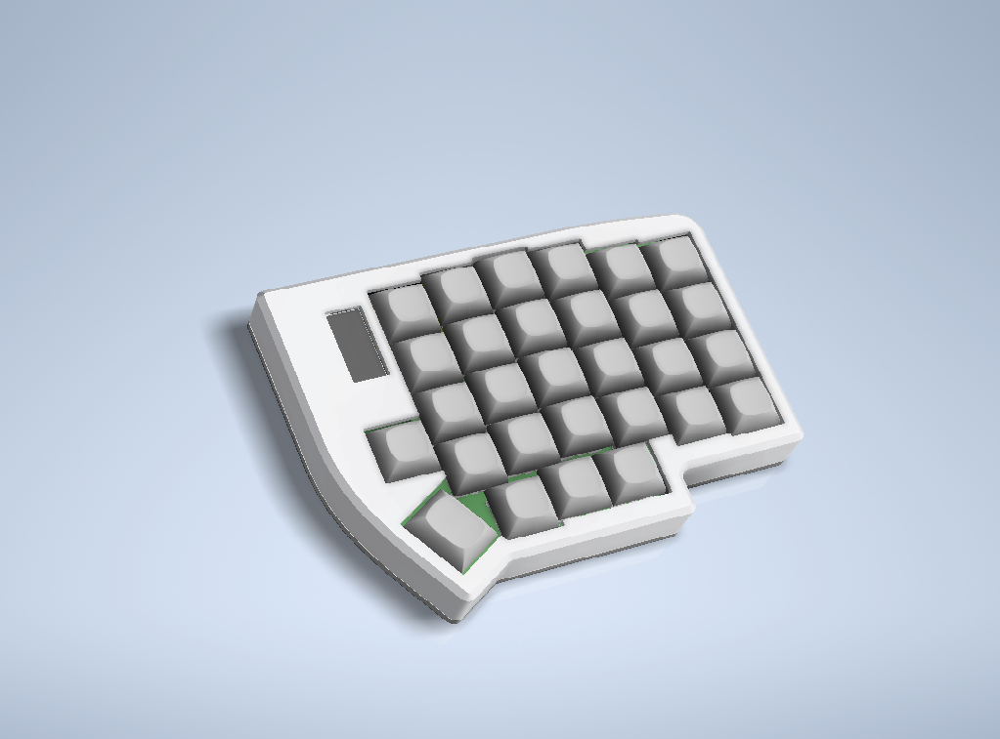
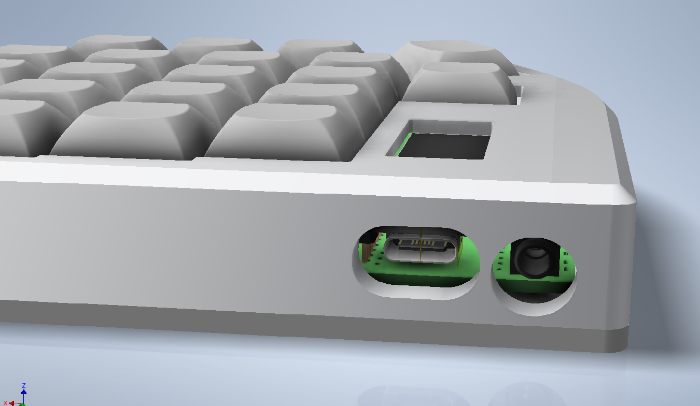
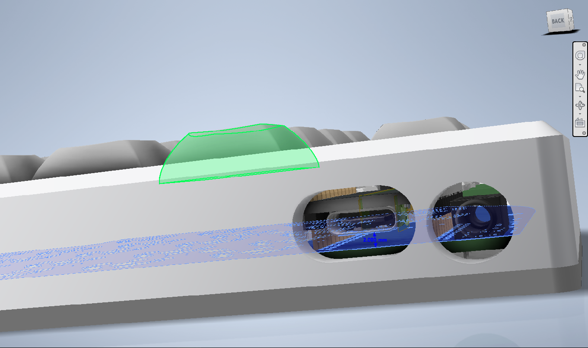
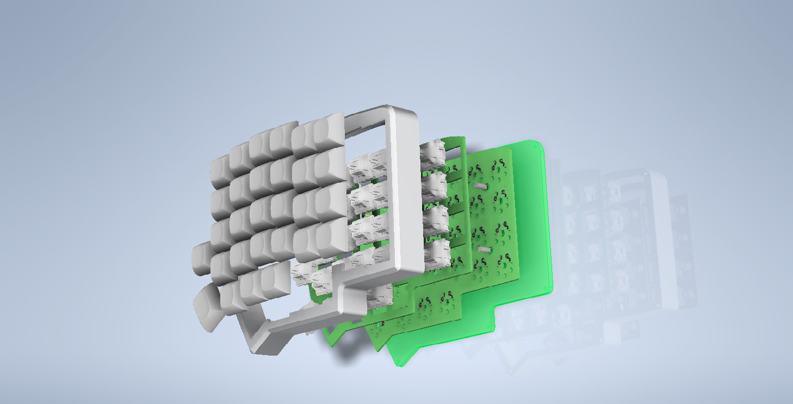
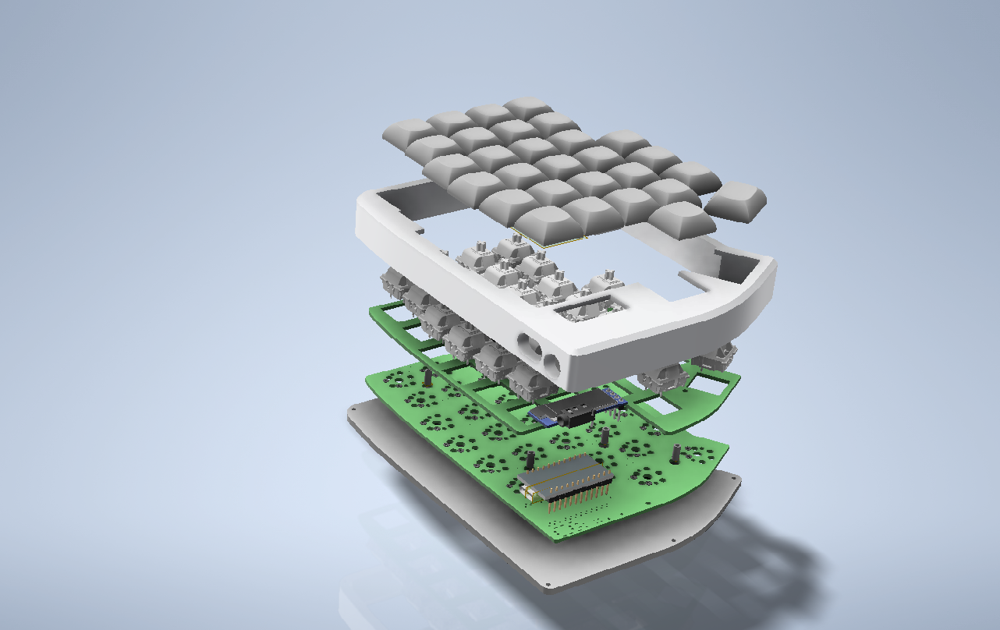

### Required hardware

- [Left upper case](https://github.com/ergomechstore/lily58-pro-fully-enclosed/blob/main/left-side-case.stl) x1

- [Right upper case](https://github.com/ergomechstore/lily58-pro-fully-enclosed/blob/main/right-side-case.stl) x1
 
- [Bottom plate](https://github.com/ergomechstore/lily58-pro-fully-enclosed/blob/main/bottom-plate.stl) x2 - this can be cut in acrylic or whatever material you like

- 5mm M2 screws x 32

- Lily58 kit with 1.5mm thick stainless steel/ FR4 plates (or 3mm thick acrylic plates) you can get a kit [here](https://ergomech.store/shop/product/lily58-3)

### How to align the controller correctly

The case is designed so that the cutouts for the controllers and TRRS jack are aligned with the controllers precisely, thus improve aesthetic of the case. Due to this reason, you'll have to install the controllers at the correct height and position:

- Both controllers should face down, the distance from the lowest part of the controllers to the PCB should be 2-3mm

- If you use the socket included in the kit from Ergomech.store, the distance will conform to this requirement so you won't need to anything.

### Pictures

